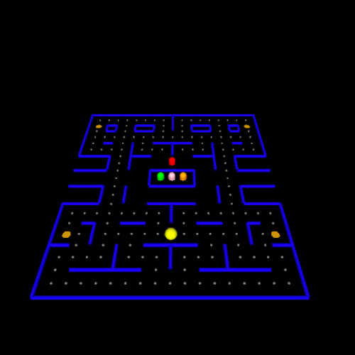

# Pacman

This is a Pacman game based on OpenGL and OpenMP.



## Build

The game is developed on macOS Mojave 10.14.6. It also gets tested on Arch
Linux.

The top level `CMakeLists.txt` is for both macOS Mojave and Arch Linux. To build
the program, make sure you are in the project directory, then follow the
commands below:

```sh
mkdir build
cd build/
cmake ..
make
./Pacman
```

Then the program should run.
